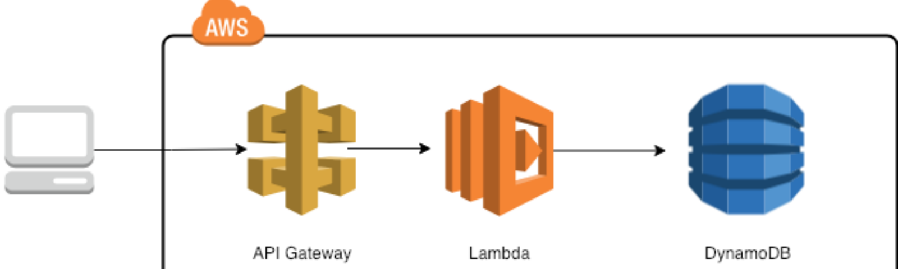

# Trambo-Terraform
Guatemala, April 2020. This project creates a api gateway to consume lambda functions which stores data in a dynamo table.

# Modules
- [Roles & Policies](#roles-&-policies)
- [Dynamo DB](#dynamodb)
- [Lambda](#lambda)
- [Api Gateway](#api-gateway)

# Roles & Policies
In this [module](/modules/Rol/main.tf) i define all the roles and policies that will be used in the rest of modules.

- aws_iam_role_policy
This policies will be defined to increase the security and just give the needed permissions to each lambda function.
    - terraform-politica-put-elmer
    - terraform-politica-edit-elmer
    - terraform-politica-read-elmer
    - terraform-politica-delete-elmer

- aws_iam_role
This roles will be defined to attach to each lambda function to increase the security.
    - terraform-rol-put-elmer
    - terraform-rol-edit-elmer
    - terraform-rol-read-elmer
    - terraform-rol-delete-elmer

# DynamoDb
In this [module](/modules/Dynamo/main.tf) i define the dynamo db table that will be consumed by the lambdas functions.

- aws_dynamodb_table
    terraform-dynamotable-pacientes

# Lambda
In this [module](/modules/Lambda/main.tf) i define every lambda function.

- Code Lambda functions
This code was written using node js.
    - [delete.js](/modules/Lambda/delete.js)
    - [get_all.js](/modules/Lambda/get_all.js)
    - [put.js](/modules/Lambda/put.js)
    - [update.js](/modules/Lambda/update.js)

- archive_file
It was necessary compress the code in a zip file.
    - zip_get_all
    - zip_put
    - zip_delete
    - zip_update

- aws_lambda_function
There was necessary defina every lambda function that will be consumed by the api gateway.
    - terraform-lambda_get_all-elmer
    - terraform-lambda_put-elmer
    - terraform-lambda_delete-elmer
    - terraform-lambda_update-elmer

# Api Gateway
In this [module](/modules/Lambda/main.tf) i define a HTPP api to comunicate lambda functions using http verbs .

- aws_api_gateway_resource
    - proxy

- aws_api_gateway_method
    - method
    - method_put
    - method_delete
    - method_update

- aws_api_gateway_method_response
    - exampleMethodResponse
    - PutMethodResponse
    - DeleteMethodResponse
    - UpdateMethodResponse

- aws_api_gateway_integration_response
    - lambda-getResponse
    - lambda-putResponse
    - lambda-deleteResponse
    - lambda-updateResponse

- aws_api_gateway_integration
    - lambda-get
    - lambda-put
    - lambda-delete
    - lambda_update

- aws_lambda_permission
It was necessary define permissions for every lambda function.
    - apigw_get
    - apigw_put
    - apigw_delete
    - apigw_update

- aws_api_gateway_deployment
    - test